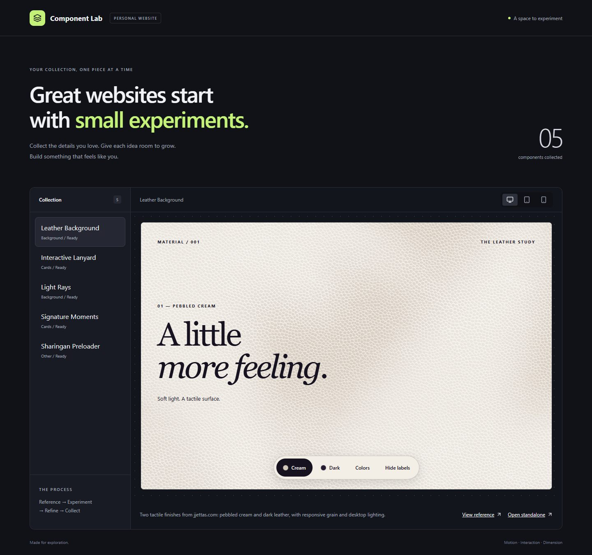
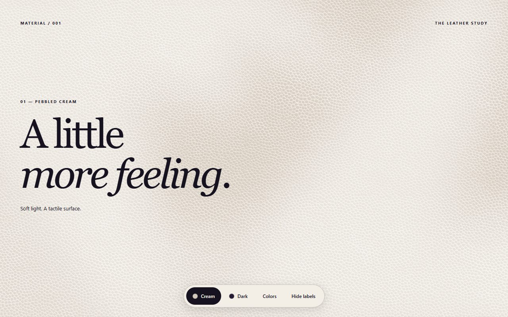
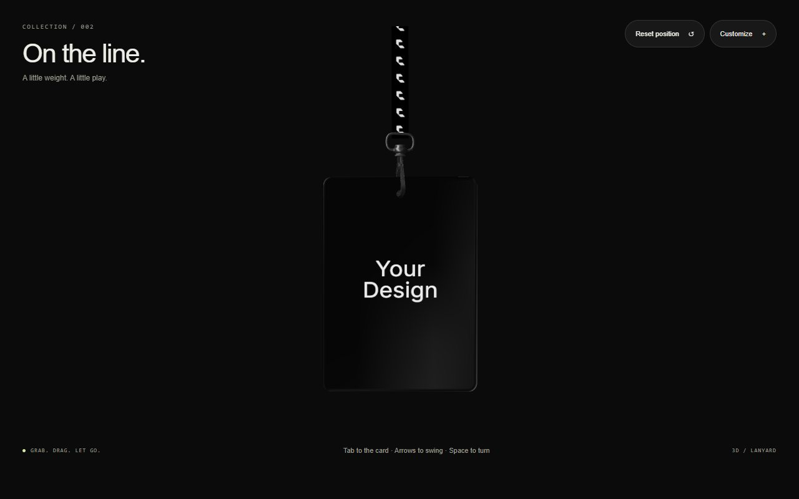
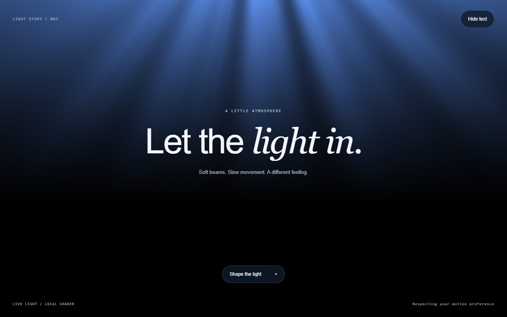
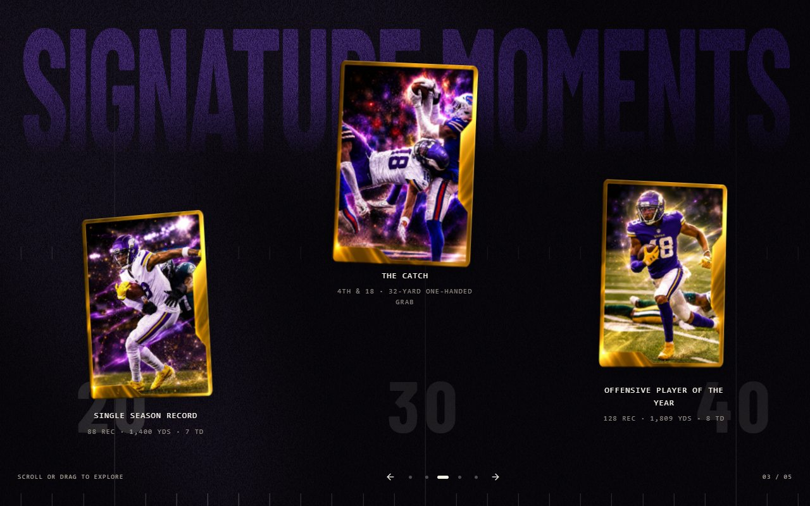
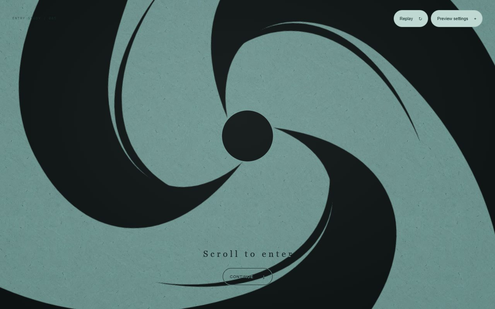
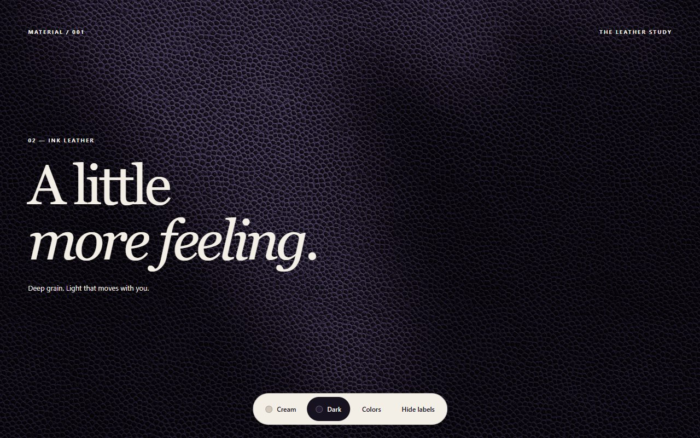

  

<h1 align="center">Rishi's Component Lab</h1>

  <strong>Explore the details. Build the experience.</strong> 
  A growing collection of tactile materials, interactive 3D, and expressive motion 
  for a future personal website.

  
  
  
  

  <a href="https://rishi-component-lab.vercel.app"><strong>Open the live lab ↗</strong></a>
  &nbsp; · &nbsp;
  <a href="#component-showcase">Explore components</a>
  &nbsp; · &nbsp;
  <a href="#quick-start">Run locally</a>
  &nbsp; · &nbsp;
  <a href="https://github.com/RC-Rishi/Personal-Website/issues">Report an issue</a>

## Overview

Great personal websites come together through deliberate choices. This project is a place to collect an idea, study its reference, build it as an independent React component, and refine how it feels before using it in a complete website.

The lab currently contains **five components**, each with a live demo, typed props, source notes, and interaction tests. Its gallery supports desktop, tablet, and mobile preview widths. Each preview runs in its own iframe, so responsive layouts and scrolling behave within the selected canvas.

The collection is actively evolving. The final portfolio will bring a selected set of these experiments together; the gallery is the workspace for making those choices.

**On this page:** [Showcase](#component-showcase) · [Tech stack](#tech-stack) · [Quick start](#quick-start) · [Using a component](#using-a-component) · [Development](#development) · [Project structure](#project-structure) · [Deployment](#deployment) · [Roadmap](#roadmap) · [Credits](#credits-and-licensing)

## Component showcase

These are screenshots of the running demos. Open a live preview to try the motion and controls.

<table>
  <tr>
    <td width="50%" valign="top">
      
      <h3>01 / Leather Background</h3>
      
Two tactile finishes, moving desktop light, and a palette explorer with presets and custom pebble and crevice colors.

      
<a href="https://rishi-component-lab.vercel.app/?component=leather-background">Live demo ↗</a> · <a href="src/components/leather-background/README.md">Component API</a>

    </td>
    <td width="50%" valign="top">
      
      <h3>02 / Interactive Lanyard</h3>
      
A draggable 3D pass with rope physics, custom artwork and materials, keyboard controls, and opt-in phone tilt.

      
<a href="https://rishi-component-lab.vercel.app/?component=lanyard">Live demo ↗</a> · <a href="src/components/lanyard/README.md">Component API</a>

    </td>
  </tr>
  <tr>
    <td width="50%" valign="top">
      
      <h3>03 / Light Rays</h3>
      
A lightweight WebGL light study with adjustable colors, intensity, reach, position, and movement, plus a CSS fallback.

      
<a href="https://rishi-component-lab.vercel.app/?component=rays">Live demo ↗</a> · <a href="src/components/rays/README.md">Component API</a>

    </td>
    <td width="50%" valign="top">
      
      <h3>04 / Signature Moments</h3>
      
A flying-card entrance, scroll-driven card field, pointer reflections, and flip-to-video playback with a dedicated phone layout.

      
<a href="https://rishi-component-lab.vercel.app/?component=signature-moments">Live demo ↗</a> · <a href="src/components/signature-moments/README.md">Component API</a>

    </td>
  </tr>
  <tr>
    <td colspan="2" valign="top">
      
      <h3>05 / Sharingan Preloader</h3>
      
A paper-and-ink entrance that follows actual asset readiness, releases an expanding shockwave, and awakens into a full-screen vortex. Scroll, swipe, or continue through its circular reveal. Includes two pacing presets, paper and ink colors, matte strength, and replayable loading simulations.

      
<a href="https://rishi-component-lab.vercel.app/?component=sharingan-preloader">Live demo ↗</a> · <a href="src/components/sharingan-preloader/README.md">Component API &amp; integration</a>

    </td>
  </tr>
</table>

  
<strong>Another finish: ink leather</strong>

  
The leather component also includes a dark finish with desktop lighting that follows the pointer.

  

## Built into the collection

- **Independent components.** Content and behavior are passed through typed props. The reusable components do not depend on the lab shell.
- **Live customization.** Explore material palettes, lighting, artwork, motion settings, and preloader appearance directly in the demos.
- **Responsive previews.** Switch between desktop, tablet, and phone canvases, or open a component on its own page.
- **Considered interaction.** Keyboard and touch support, visible focus states, and reduced-motion behavior are implemented where relevant.
- **Deferred rendering.** Component entries load on demand; 3D code is lazy-loaded, and render loops pause when appropriate for visibility, motion preferences, or idle state.
- **Usable fallbacks.** The lanyard has a static WebGL fallback, rays have a CSS fallback, and the preloader can reveal a prepared basic destination after an asset failure.

Device tilt requires a supported phone, an HTTPS connection or localhost, and explicit user activation. Browser tests cover sensor events and permission paths; physical-device feel still needs hands-on checking.

## Tech stack

| Layer | Technology | Role |
| --- | --- | --- |
| Languages | **TypeScript, CSS, HTML** | Typed components, styling, and page markup |
| UI | **React 19** | Component composition, state, and lazy loading |
| Build | **Vite 8** | Development server and production bundling |
| Motion | **Motion**, Web Animations API, CSS | Timelines, transitions, and interactive movement |
| 3D | **Three.js**, React Three Fiber, Drei | Lanyard scene, materials, and rendering |
| Physics | **Rapier**, React Three Rapier, Meshline | Badge motion, constraints, and strap rendering |
| Graphics | **SVG, WebGL, CSS** | Ink geometry, light shaders, and layered materials |
| Icons | **Lucide React** | Interface icons |
| Quality | **TypeScript 6, ESLint, Playwright** | Type checking, linting, and browser verification |
| Hosting | **Vercel + GitHub** | Static hosting and automatic deployments from `main` |

Dependency versions are recorded in [`package.json`](package.json) and pinned by [`package-lock.json`](package-lock.json).

## Quick start

You need **Git** and **Node.js 22.12 or newer**. Node.js 24 is used for the current Vercel deployment.

~~~bash
git clone https://github.com/RC-Rishi/Personal-Website.git
cd Personal-Website
npm ci
npm run dev
~~~

Open **[localhost:5173](http://127.0.0.1:5173)**. The current lab runs entirely in the browser and requires no API keys, backend service, or environment variables.

On Windows, use `npm.cmd` instead of `npm` if PowerShell blocks `npm.ps1`.

To run the production build locally:

~~~bash
npm run build
npm run preview
~~~

Vite prints the preview address, normally `http://127.0.0.1:4173`.

## Using a component

Components live in this repository and can be imported directly within the app. For example:

~~~tsx
import LeatherBackground from './components/leather-background/LeatherBackground'

export default function PersonalHero() {
  return (
    <LeatherBackground
      finish="dark"
      palette={{ pebble: '#183E32', crevice: '#82AA8D' }}
      style={{ minHeight: '100svh', padding: 'clamp(24px, 6vw, 80px)' }}
    >
      <h1>Make something worth exploring.</h1>
    </LeatherBackground>
  )
}
~~~

When moving a component to another project, bring its supporting files and required `public/assets/<component>/` assets, install its dependencies, and check its API documentation for sizing and integration requirements. The [preloader integration guide](src/components/sharingan-preloader/README.md) explains how the host supplies loading progress, prepares the destination, and transfers focus after entry.

## Development

| Command | Purpose |
| --- | --- |
| `npm run dev` | Start the local Vite server |
| `npm run build` | Type-check and build the site into `dist/` |
| `npm run preview` | Serve the production build locally |
| `npm run typecheck` | Run TypeScript checks |
| `npm run lint` | Run ESLint |
| `npm run test:e2e -- --workers=1` | Run browser tests with one worker |
| `npm run test:e2e:ui` | Open the interactive Playwright test runner |
| `npm run inspect -- <url> <name>` | Capture a reference page and initial observations |

### Browser testing

The default Playwright configuration uses an installed **Google Chrome**. Tests cover desktop, Pixel 7 touch emulation, and reduced-motion desktop. A single worker is useful for consistent timing when exercising video and 3D scenes.

  
<strong>Use Playwright's bundled Chromium instead</strong>

Install the browser:

~~~bash
npx playwright install chromium
~~~

On macOS or Linux:

~~~bash
LAB_BROWSER_CHANNEL=chromium npm run test:e2e -- --workers=1
~~~

On Windows PowerShell:

~~~powershell
$env:LAB_BROWSER_CHANNEL = 'chromium'
npm.cmd run test:e2e -- --workers=1
~~~

On a Linux machine that also needs browser system dependencies, use `npx playwright install --with-deps chromium`.

The suite checks real interactions: dragging, playback, palette controls, loading and failure paths, focus transfer, resize behavior, rendering suspension, and reduced motion. Verification records, including reruns and remaining device limitations, are kept in [`references/`](references/). Screenshots, traces, and HTML reports are generated locally and ignored by Git.

### Adding a component

1. Copy [`references/TEMPLATE.md`](references/TEMPLATE.md) and document the exact reference, interactions, asset sources, and intended differences.
2. Inspect the reference in a browser, including desktop and touch behavior.
3. Create the reusable component, styles, and a separate demo in `src/components/<name>/`.
4. Add a lazy demo entry to [`src/lab/registry.ts`](src/lab/registry.ts) and put required media in `public/assets/<name>/`.
5. Run build, lint, and meaningful browser checks; inspect desktop and mobile captures before marking it ready.

Bug reports and focused improvements are welcome through [issues](https://github.com/RC-Rishi/Personal-Website/issues) and pull requests. For a new visual component, include its reference, intended behavior, and mobile expectations. Follow the repository's [component workflow](AGENTS.md).

## Project structure

~~~text
Personal-Website/
├── docs/images/           # Screenshots used in this README
├── public/assets/         # Runtime textures, models, fonts, and demo media
├── references/            # Reference studies, provenance, verification, backlog
├── scripts/               # Reference inspection tools
├── src/
│   ├── components/        # Independent components and their lab demos
│   ├── lab/registry.ts    # Typed collection and lazy demo imports
│   ├── App.tsx            # Gallery shell and standalone preview routing
│   ├── styles.css         # Lab layout and interface styles
│   └── tokens.css         # Shared lab design tokens
├── tests/                 # Playwright specs and integration fixtures
├── playwright.config.ts   # Desktop, mobile, and reduced-motion projects
├── vercel.json            # Vite deployment configuration
└── vite.config.ts         # Local development and build configuration
~~~

Required runtime media under `public/assets/` is versioned. The root `/assets/` folder holds local reference originals and is ignored. README screenshots stay in `docs/images/`, outside the public website assets.

## Deployment

**Live site:** [rishi-component-lab.vercel.app](https://rishi-component-lab.vercel.app)

This repository is connected to Vercel. Pushing to **`main`** automatically builds and updates the production site. The project serves Vite's static output; no application server is required.

| Setting | Value |
| --- | --- |
| Framework preset | Vite |
| Install command | `npm ci` |
| Build command | `npm run build` |
| Output directory | `dist` |
| Production branch | `main` |
| Required environment variables | None |

For your own deployment, import a fork into Vercel with the repository root selected. The checked-in [`vercel.json`](vercel.json) provides the build settings. [`.vercelignore`](.vercelignore) excludes local references, captures, environment files, dependencies, and documentation images from CLI uploads.

## Roadmap

- [x] Responsive component gallery with isolated previews
- [x] Leather materials and palette explorer
- [x] Physics-based lanyard with opt-in device tilt
- [x] Customizable light rays
- [x] Scroll-driven cards with video playback
- [x] Paper-and-ink preloader with real readiness controls
- [x] Public demos and automatic GitHub deployments
- [ ] Embossed and debossed content on material surfaces
- [ ] Component scaffolding command
- [ ] Optional performance diagnostics in the lab
- [ ] Compose selected components into the personal website

Future ideas and implementation notes live in [`references/BACKLOG.md`](references/BACKLOG.md).

## Credits and licensing

Created and maintained by **[Rishi / RC-Rishi](https://github.com/RC-Rishi)**.

The leather and Signature Moments studies draw from **JJettas**; the lanyard and rays studies use the supplied **Framer University** references. The preloader develops a user-provided Sharingan-inspired visual direction. Exact sources, asset ownership, and intentional differences are documented in the [reference studies](references/) and the asset `SOURCES.md` files under [`public/assets/`](public/assets/).

Reference artwork and clips are demo material, not a production-use license. The fifth Signature Moments card intentionally repeats a smaller clip to keep the demo lighter. Replace reference media with your own or appropriately licensed assets when composing a personal site.

This repository does not currently include a project-wide license. Third-party assets and dependencies retain their respective licenses; the bundled Barlow Condensed font includes its [SIL Open Font License](public/assets/signature-moments/OFL.txt).

---

  <strong>Reference → Experiment → Refine → Collect</strong> 
  <a href="https://rishi-component-lab.vercel.app">Explore the live collection ↗</a>

